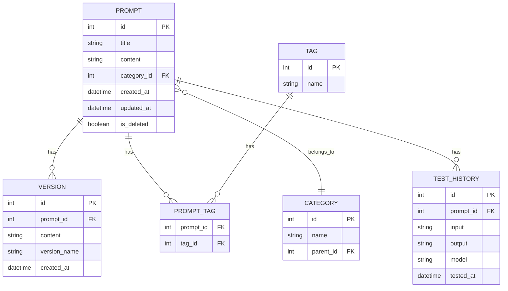

# Prompter - 提示词管理器 MVP 需求文档

## 项目概述

Prompter 是一个本地桌面应用，用于管理、编辑和测试 AI 提示词。基于 Tauri + Next.js 构建，使用 SQLite 作为本地数据存储。

---

## 设计规范

### 布局风格

采用 **VSCode 风格布局**，三栏式结构：

```
┌─────────────────────────────────────────────────────────────┐
│  Activity Bar │  Sidebar  │  Editor Group                   │
│  (图标导航)    │  (资源管理) │  (主编辑区)                     │
└─────────────────────────────────────────────────────────────┘
```

| 区域 | 说明 |
|------|------|
| Activity Bar | 左侧垂直图标栏，切换不同功能面板 |
| Sidebar | 可折叠侧边栏，显示分类/标签/文件树 |
| Editor Group | 主内容区，支持多标签页 |
| Panel | 底部面板，显示测试结果/历史 |
| Status Bar | 底部状态栏，字数/版本/同步状态 |

### 配色方案

**不使用 VSCode 配色**，采用现代暖色调设计：

| 角色 | Light Mode | Dark Mode |
|------|------------|-----------|
| 背景主色 | `#FAFAF9` (Stone 50) | `#1C1917` (Stone 900) |
| 背景次色 | `#F5F5F4` (Stone 100) | `#292524` (Stone 800) |
| 主题强调 | `#F97316` (Orange 500) | `#FB923C` (Orange 400) |
| 文字主色 | `#1C1917` | `#FAFAF9` |
| 文字次色 | `#78716C` (Stone 500) | `#A8A29E` (Stone 400) |
| 成功色 | `#22C55E` (Green 500) | `#4ADE80` (Green 400) |
| 警告色 | `#EAB308` (Yellow 500) | `#FACC15` (Yellow 400) |
| 错误色 | `#EF4444` (Red 500) | `#F87171` (Red 400) |

### 图标优先原则

**界面交互优先使用图标，减少文字按钮**

| 操作 | 图标 | 说明 |
|------|------|------|
| 新建 | `+` / `Plus` | - |
| 删除 | `Trash2` | - |
| 编辑 | `Pencil` | - |
| 搜索 | `Search` | - |
| 设置 | `Settings` | - |
| 保存 | `Save` | - |
| 撤销 | `Undo2` | - |
| 重做 | `Redo2` | - |
| 源码视图 | `Code` | 仅图标 |
| 预览视图 | `Eye` | 仅图标 |
| 双栏视图 | `Columns2` | 仅图标 |
| 运行测试 | `Play` | - |
| 版本历史 | `History` | - |
| Diff 对比 | `GitCompare` | - |
| 折叠侧边栏 | `PanelLeftClose` | - |
| 展开侧边栏 | `PanelLeft` | - |

**图标库**: 使用 [Lucide Icons](https://lucide.dev/)（shadcn/ui 默认图标库）

---

## 核心功能

### 1. 提示词管理

| 功能 | 描述 |
|------|------|
| 创建 | 新建提示词，支持标题、内容、标签、分类 |
| 编辑 | 修改提示词内容及元数据 |
| 删除 | 软删除，支持回收站恢复 |
| 搜索 | 支持标题、内容、标签的全文搜索 |
| 分类/标签 | 多级分类 + 多标签管理 |

---

### 2. Markdown 编辑器

#### 三种视图模式

通过工具栏图标切换：

| 图标 | 模式 | 说明 |
|------|------|------|
| `Code` | 源码 | 纯 Markdown 编辑 |
| `Eye` | 预览 | 实时渲染预览 |
| `Columns2` | 双栏 | 左编辑右预览，同步滚动 |

#### Markdown 渲染方案（最全最美观）

采用 **MDX + 高级插件** 组合，确保功能最全、渲染最美观：

```
核心渲染: @mdx-js/mdx
├── remark 插件（解析增强）
│   ├── remark-gfm          # GitHub 风格（表格、任务列表、删除线）
│   ├── remark-math         # 数学公式支持
│   ├── remark-emoji        # Emoji 短码 :smile:
│   └── remark-directive    # 自定义容器语法
│
├── rehype 插件（渲染增强）
│   ├── rehype-katex        # LaTeX 公式渲染
│   ├── rehype-slug         # 标题自动 ID
│   ├── rehype-autolink-headings  # 标题锚点链接
│   └── rehype-pretty-code  # 代码高亮 (基于 Shiki)
│
└── 样式美化
    ├── @tailwindcss/typography  # prose 排版
    └── 自定义主题 CSS            # 适配配色方案
```

**支持的 Markdown 特性：**

| 特性 | 示例 |
|------|------|
| GFM 表格 | `\| col \| col \|` |
| 任务列表 | `- [x] 完成` |
| 删除线 | `~~删除~~` |
| 脚注 | `[^1]` |
| 数学公式 | `$E=mc^2$` / `$$...$$` |
| 代码高亮 | 支持 100+ 语言，行号、行高亮、Diff |
| Mermaid 图表 | 流程图、时序图、甘特图等 |
| 自定义容器 | `:::tip` `:::warning` 等 |
| 自动链接 | URL 自动转链接 |
| Emoji | `:rocket:` → 🚀 |

---

### 3. 版本管理

| 功能 | 描述 |
|------|------|
| 自动保存 | 编辑时自动创建版本快照 |
| 版本历史 | 查看提示词的所有历史版本 |
| 版本回滚 | 恢复到任意历史版本 |
| 版本对比 | 选择两个版本进行 Diff 对比 |

---

### 4. Diff 对比

- 支持行级 Diff（增/删/改高亮）
- 支持并排对比视图
- 使用 `react-diff-viewer-continued` 或 Monaco Editor Diff

---

### 5. 提示词测试

| 功能 | 描述 |
|------|------|
| API 配置 | 配置 OpenAI/其他 LLM API Key |
| 快速测试 | 直接发送提示词到 LLM 获取响应 |
| 变量替换 | 支持 `{{变量}}` 占位符，测试时填充 |
| 历史记录 | 保存测试历史，方便对比效果 |

---

## 数据模型



---

## 技术栈

| 层级 | 技术 |
|------|------|
| 桌面框架 | Tauri 2.x |
| 前端 | Next.js + React + TypeScript |
| 状态管理 | Zustand |
| UI 组件 | shadcn/ui + Lucide Icons |
| 数据库 | SQLite (via Tauri SQL Plugin) |
| Markdown | `@mdx-js/mdx` + remark/rehype 插件链 |
| 代码高亮 | Shiki (via `rehype-pretty-code`) |
| 数学公式 | KaTeX |
| Mermaid | `mermaid` + `rehype-mermaid` |
| Diff | `react-diff-viewer-continued` |
| 编辑器 | Monaco Editor 或 CodeMirror 6 |

---

## MVP 里程碑

### Phase 1: 基础框架 ✅
- [x] 项目初始化
- [ ] SQLite 数据库集成
- [ ] VSCode 风格布局骨架
- [ ] 配色主题系统

### Phase 2: 核心功能
- [ ] 提示词 CRUD
- [ ] Markdown 编辑器（三视图）
- [ ] 分类/标签管理

### Phase 3: 版本管理
- [ ] 版本快照
- [ ] 版本历史列表
- [ ] Diff 对比视图

### Phase 4: 测试功能
- [ ] API 配置
- [ ] 提示词测试
- [ ] 测试历史

---

## UI 原型参考

> VSCode 风格布局（图标优先）

```
┌───┬───────────┬──────────────────────────────────────────┐
│   │           │  📄 prompt-1.md  ×  │  📄 prompt-2.md    │
│ 📁│  分类     ├──────────────────────────────────────────┤
│   │  ├─ 编程  │  ┌────────────────────────────────────┐  │
│ 🏷️│  ├─ 写作  │  │ [≡] [↺] [↻]      [</> 👁 ▣]  [▶ ⏱] │  │
│   │  └─ 翻译  │  ├────────────────────────────────────┤  │
│ 🧪│           │  │                                    │  │
│   │  标签     │  │   Markdown 编辑 / 预览区域          │  │
│ ⚙️│  • GPT4   │  │                                    │  │
│   │  • 常用   │  │                                    │  │
│   │           │  └────────────────────────────────────┘  │
├───┴───────────┴──────────────────────────────────────────┤
│  ✓ Saved  │  v1.2.3  │  1,234 chars  │  UTF-8            │
└──────────────────────────────────────────────────────────┘

图例:
📁 = 资源管理器    🏷️ = 标签管理    🧪 = 测试面板    ⚙️ = 设置
</> = 源码视图    👁 = 预览视图    ▣ = 双栏视图
▶ = 运行测试     ⏱ = 历史记录
≡ = 菜单         ↺ = 撤销         ↻ = 重做
```

---

## 后续扩展（非 MVP）

- 提示词模板市场
- 云同步
- 团队协作
- 提示词效果评分
- 批量测试
